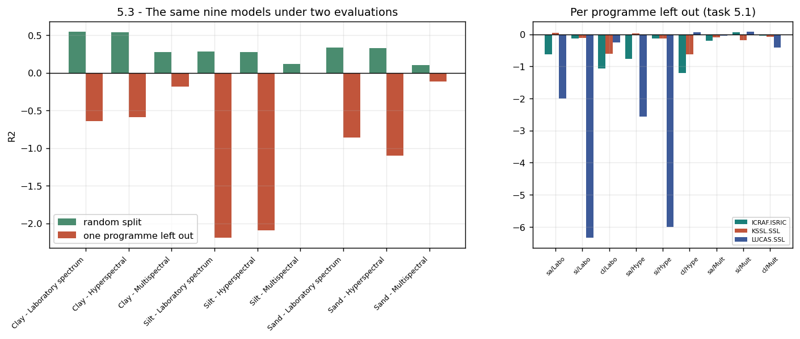
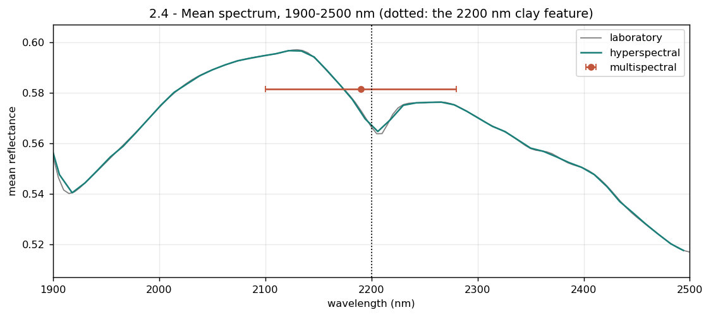

# Soil Texture from Spectra

Predicting sand, silt and clay from soil reflectance spectra, and measuring how much of that
ability survives when a satellite measures the soil instead of a laboratory.

40 535 soil samples from the [Open Soil Spectroscopy Library](https://soilspectroscopy.github.io),
each with 421 reflectance values from 400 to 2500 nm.

## The main result

I trained the same model under two evaluations. In the first one I split the samples
randomly. In the second one I trained on two surveys and tested on a third survey that the
model had never seen.

| Change | Cost in R2 |
|---|---|
| 410 laboratory wavelengths down to 11 satellite bands | **0.223** |
| Random split to one survey left out | **1.174** |

**The way I evaluate the model costs more than five times the sensor.** Sixteen of the
eighteen scores under the second evaluation are negative, which means the model is worse than
simply predicting the average.



*The same nine models under the two evaluations. Green is the random split, red is one survey
left out. The right panel shows the three folds are very different from each other.*

Two more findings:

- **The richer version of the spectra transfers worse.** Clay loses 1.185 R2 with the full
  spectra, but only 0.453 with 11 bands. With 410 wavelengths the model can learn the
  signature of each instrument and use it as a shortcut. Eleven wide bands are too coarse
  for that.
- **A wide band can erase a feature completely.** Band B12 is 180 nm wide, so the clay
  absorption near 2200 nm and both of its sides fall inside one number. The depth of the
  feature goes from 0.0203 in the laboratory to exactly 0.0000 in multispectral.



*Mean spectrum between 1900 and 2500 nm. Grey is the laboratory, green is hyperspectral, and
the red point with the bar is the single 180 nm satellite band.*

## How to run it

```bash
git clone https://github.com/Abdelmalek05/soil-texture-from-spectra.git
cd soil-texture-from-spectra
pip install -r requirements.txt
jupyter notebook soil_texture_lab.ipynb
```

Then run all cells, from top to bottom. It takes about 5 minutes. The data is already in
`data/`, so there is nothing to download. The notebook creates `figs/` and `tables/` itself.

On Google Colab, open the notebook and put these two lines in a new first cell:

```python
!git clone https://github.com/Abdelmalek05/soil-texture-from-spectra.git
%cd soil-texture-from-spectra
```

## What is in this repository

| Path | What it is |
|---|---|
| `soil_texture_lab.ipynb` | The whole analysis. Sections 0 to 6, 44 tasks, every cell labelled with its task number |
| `report.pdf` | A 4 page report of the work |
| `report.tex` | The LaTeX source of the report |
| `data/` | The three data files, gzipped. `pandas` reads them directly |
| `figs/`, `tables/` | The 24 figures and 8 tables produced by the notebook |

## What the notebook does

| Section | What it answers |
|---|---|
| 1 | Exploring the data: spectra, targets, programmes, depth, correlations |
| 2 | Building two simulated satellites from the laboratory spectra |
| 3 | Predicting what will work, written down before any model is trained |
| 4 | A first model on 11 satellite bands |
| 5 | The same model under two different evaluations |
| 6 | What the model uses, and how much I can trust that answer |

## Two things to know about this data

- **The wavelengths 400 to 450 nm are missing for all 22 171 LUCAS samples.** Their
  instrument starts at 455 nm. So every model here uses the 410 columns from 455 to 2500 nm.
- **The survey is also the instrument, the region and the sampling depth.** Each survey used
  one instrument in one part of the world. When I remove one survey from training, all of
  these change at the same time. So the table above shows *what* drops, but it cannot show
  *which cause* is responsible.

## Licence

MIT, see [LICENSE](LICENSE). The data comes from the Open Soil Spectroscopy Library and keeps
its own licence (CC-BY).
